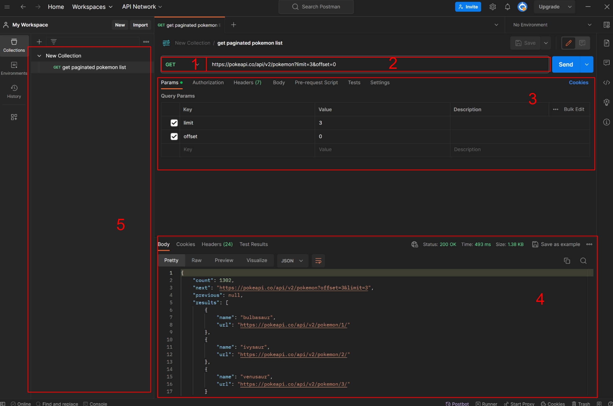
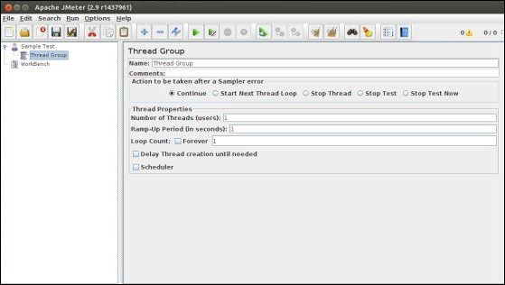
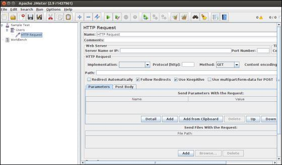
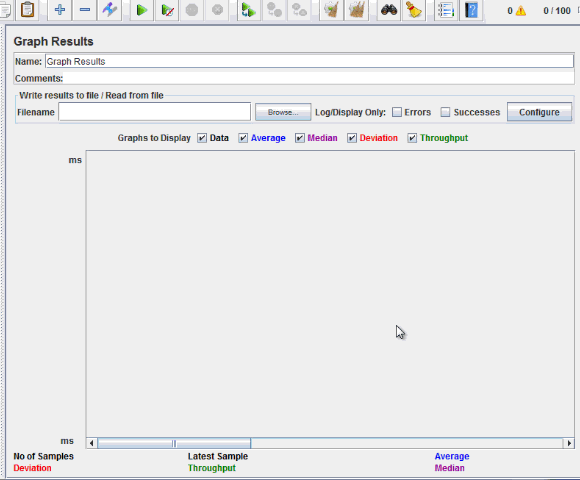

# La QA - ou comment s'assurer qu'une app fonctionne <!-- omit in toc -->

## Sommaire <!-- omit in toc -->

- [1. Définition](#1-définition)
- [2. Quand intégrer la QA ?](#2-quand-intégrer-la-qa-)
- [3. Qui intervient ?](#3-qui-intervient-)
  - [a. Les développeur.ses](#a-les-développeurses)
  - [b. Les utilisateur.rices](#b-les-utilisateurrices)
  - [c. Les QA](#c-les-qa)
- [4. Les protocoles de test](#4-les-protocoles-de-test)
  - [a. Les tests manuels](#a-les-tests-manuels)
  - [b. Les tests unitaires](#b-les-tests-unitaires)
  - [c. Les tests fonctionnels](#c-les-tests-fonctionnels)
  - [d. Les tests E2E](#d-les-tests-e2e)
  - [e. Les tests de performance](#e-les-tests-de-performance)
- [5. Analyse et audit](#5-analyse-et-audit)
  - [a. Analyse statique de code](#a-analyse-statique-de-code)
  - [b. Audit externe de site web](#b-audit-externe-de-site-web)
- [6. Automatiser avec la CI/CD](#6-automatiser-avec-la-cicd)
- [7. Méthodologie du TDD](#7-méthodologie-du-tdd)
- [8. Installation des outils](#8-installation-des-outils)
  - [PHPUnit](#phpunit)
  - [PHPStan](#phpstan)
  - [Vitest](#vitest)
  - [Playwright](#playwright)
  - [ESLient et Prettier](#eslient-et-prettier)
  - [Selenium IDE](#selenium-ide)
  - [Apache JMeter](#apache-jmeter)


## 1. Définition

La QA, pour Quality Assurance, est un processus mis en place pour déterminer qu'un produit ou un service remplit des standards de qualités déterminés par une équipe, une entreprise ou l'industrie de manière générale. 

On lui donne en général 3 objectifs à remplir : 

 - garantir qu'une fonctionnalité à été développée en accord avec un cahier des charges
 - limiter l'introduction de bugs
 - améliorer continuellement la qualité du produit livré

## 2. Quand intégrer la QA ?

La QA intervient tout au long de la vie d'un produit. C'est un processus proactif. C'est d'ailleurs la principale différence entre la QA et la QC (quality control). La première va tout autant avoir lieu lors du développement qu'après la livraison du code, pour prévenir des défauts, alors que la seconde aura lieu une fois le programme en production pour tester et corriger le code.

## 3. Qui intervient ?

### a. Les développeur.ses

Les développeurs et développeuses doivent dans la théorie tester leur code et fournir des scénarios reproductibles pour que d'autres puissent tester également. Ils permetttent d'une part de garantir que le code ajouté au logiciel est en accord avec le cahier des charges, et d'autre part qu'il ne dégrade pas le reste du logiciel. Les tests peuvent avoir lieu pendant le développement d'une fonctionnalité, une fois qu'elle est développée, et avant de l'intégrer au reste de l'application. 

Le plus souvent, ces tests sont codés et sont versionnés, de la même manière que le reste du programme. Cela permet de tenir un historique et de suivre le évolutions du code et des tests. Cela permet aussi de pouvoir automatiser l'exécution des tests.

### b. Les utilisateur.rices

D'une certaine manière, toutes les personnes qui utilisent un programme font partie de la QA. En l'utilisant, elles vont attendre à ce qu'il remplisse ses fonctions et qu'aucun bug ne vienne perturber leur expérience. Si ce n'est pas le cas, elles peuvent faire appel au support technique pour relever la malfonction.

### c. Les QA

On peut assigner le rôle d'ingénieur QA à certaines personnes d'une équipe technique. Ce seront les référent.es fonctionnels de l'application. Les QAs vont intervenir le plus souvent à la fin du développement d'une fonctionnalité et avant qu'elle soit intégrée au reste du programme. Mais également avant des livraisons importantes en production, pour s'assurer que le produit final correspond aux attentes du client.

## 4. Les protocoles de test

### a. Les tests manuels

Les tests manuels sont les plus simples à réaliser. En contrepartie, il est assez difficile d'être rigoureux avec. On aura du mal à 
 - estimer la couverture des tests (quelles fonctionnalités sont testées)
 - savoir comment réaliser les tests
 - savoir comment générer des jeux de tests
 - garder un historique des évolutions des méthodes de tests
 - prouver que le test réalisé correspond aux attentes
 - prouver que le test a été réalisé

Il est nécessaire d'utiliser un outil externe pour rassembler les informations sur les tests réalisés. Quelle fonctionnalité est téstée, les étapes pour réaliser le test, les jeux de donnés utilisés, le résultat attendu de chacune de ces étapes, le résultat obtenu, le temps passé pour réaliser le test. 

[xray (de jira)](https://marketplace.atlassian.com/apps/1211769/xray-test-management-for-jira?tab=overview&hosting=cloud) fait parti de ces outils.

### b. Les tests unitaires

Définition : tester une petite partie du code, indépendante du reste de l'application.

Exemple : test d'une fonction d'addition.

**En PHP avec PHPUnit**

Soit la méthode : 

```php
/**
 * @param int $num1
 * @param int $num2
 * 
 * @return int
 */
public function addition(int $num1, int $num2): int
{
    return $num1 + $num2;
}
```

Cette méthode ne fait pas appel à une autre, elle ne dépend pas d'un `$this`, elle peut donc être facilement testable unitairement : 

```php
<?php
use PHPUnit\Framework\TestCase; // on importe les outils de test de PHPUnit

class AdditionTest extends TestCase // on crée une classe et on la surchage avec PHPUnit
{
    public function testAddition() //une methode avec `test` au début = 1 test
    {
        $result = addition(2, 3); // on exécute la méthode à tester
        $this->assertEquals(5, $result); // on vérifie avec `assertEquals` que le résultat de la méthode testée corresponde au résultat attentu 
    }
}
?>
```

**En JS avec Vitest**

Soit la méthode : 

```ts
function addition(num1: number, num2: number): number {
    return num1 + num2;
}
```

```ts
import { test } from 'vitest' // on importe les outils de test de Vitest

test('addition', () => { //on utilise la méthode `test` de vitest pour créer un nouveau test
  const result = addition(2, 3) // on exécute la méthode à tester
  expect(result).toBe(5) // on vérifie avec `expect().toBe()` que le résultat de la méthode testée corresponde au résultat attentu 
})
```

### c. Les tests fonctionnels

Définition : tester une fonctionnalité d'une application

Exemple : test la récupération de la liste des users d'une API

**En PHP avec PHPUnit**

Soit l'endpoint suivant, avec le framework Symfony :

```php
<?php

namespace App\Controller;

use Symfony\Bundle\FrameworkBundle\Controller\AbstractController;
use Symfony\Component\HttpFoundation\JsonResponse;
use Symfony\Component\Routing\Annotation\Route;
use Doctrine\ORM\EntityManagerInterface;
use App\Entity\User;

class UserController extends AbstractController
{
    #[Route('/users', name: 'get_users', methods:['GET'])]
    public function getUsers(EntityManagerInterface $entityManager): JsonResponse
    {
        $data = $entityManager->getRepository(User::class)->findAll();
        return $this->json(
            $data,
            headers: ['Content-Type' => 'application/json;charset=UTF-8']
        );
    }
}
```

Nous pouvons tester cet endpoint pour nous assurer que seul le verbe http `GET` puisse être utilisé : 

```php
<?php

namespace App\Tests;

use Symfony\Bundle\FrameworkBundle\Test\WebTestCase;

class UserControllerTest extends WebTestCase
{

    /**
     * @dataProvider dataprovider_getUsers_checkAuthorizedMethods
     */
    public function test_getUsers_checkAuthorizedMethods(string $method)
    {
        $client = static::createClient();
        $client->request($method, '/users');
        $this->assertEquals(405, $client->getResponse()->getStatusCode());
    }

    private static function dataprovider_getUsers_checkAuthorizedMethods(): array
    {
        return [
            ['PUT'],
            ['DELETE'],
            ['PATCH'],
            ['POST'],
            ['OPTIONS']
        ];
    }
}
```

Pour éviter d'écrire un nouveau test par verbe, on utilise ici un `dataProvider`. Le test `test_getUsers_checkAuthorizedMethods` est lié à la méthode `dataprovider_getUsers_checkAuthorizedMethods` par l'anotation `* @dataProvider dataprovider_getUsers_checkAuthorizedMethods`. Elle va boucler pour chaque ligne dans le tableau retourné par le dataProvider, et chaque ligne sera utilisée comme paramètre du test. 

Dans cet exemple, nous aurons donc le test `test_getUsers_checkAuthorizedMethods` qui sera lancé une fois avec `$method = 'PUT`, une fois avec $method = 'DELETE`, etc

**Avec Postman comme client API**

Postman est ce qu'on appelle un client API. C'est un logiciel qui permet d'exécuter des requêtes HTTP vers un serveur API. Il est utilisable sur navigateur et sans compte, mais pour profiter de toutes ses fonctionnalités, le mieux est de télécharger le client lourd et d'utiliser un compte. Vous pouvez également utiliser des alternatives, comme Insomnia ou Thunder Client (qui est utilisable directement dans Visual Studio).



 1. sélection de verbe HTTP 

Vous devez sélectionner parmi la liste des verbes HTTP (POST, PUT, PATCH, GET, DELETE, ...) pour pouvoir envoyer votre requête

 2. url

Vers quel endpoint envoyer la requête.

 3. paramètrage de la requête

 * params correspond aux query params (aussi appelés url params), ils correspondent aux paramètres que l'ont retrouve dans l'url
 * authorization correspond à la manière dont vous vous authentifiez auprès de l'API (Bearer token, API key, OAUth, login/password, ...)
 * headers correspond aux headers envoyés avec la requête (Authorization, Content-type, ...)
 * body correspond au payload, à ce que vous envoyez comme contenu de la requête devant être traité par l'API (fichiers, formulaire JSON, ...)
 * pre-request script correspond à des scripts légers en JS s'exécutant avant de lancer la requête
 * tests correspond à des scripts légers en JS s'exécutant après la requête, vous pouvez vous en servir pour automatiser la réussité ou l'échec d'un test d'API. Postman fournit dans cet onglet des exemples de tests simples, comme vérifier le status code retour, vérifier que la réponse contienne une string, ...

 4. réponse obtenue

Détails de la réponse du serveur, avec son body, son status code, ses headers et le temps écoulé.

 5. liste de vos requêtes enregistrées

Vous pouvez enregistrer vos requêtes dans des collections pour mieux vous organiser. Vous pouvez également lancer toutes les requêtes d'une collection à la suite. Ceci est notamment pratique pour simuler un test E2E ou fonctionnel d'un API, en lançant toutes les requêtes nécessaires pour valider un scénario.

### d. Les tests E2E

Définition : tester le comportement d'un scénario, d'un use case, de l'application

Exemple : tester la redirection après la connexion à l'application web

**En JS avec Playwright**

Pour cet exemple, nous allons utiliser la page de recherche [google](https://www.google.com) et tester qu'une redirection de page a lieu.

```ts
import { test, expect } from '@playwright/test';

test('assert search redirect to search page', async ({ page }) => {
  await page.goto('https://www.google.com'); //se rendre sur la page à tester

  await page.getByRole('textarea').click(); //simuler un clic souris sur un élément html
  await page.getByRole('textarea').fill('bulbasaur'); //remplir un champs input avec du text
  
  await page.getByRole('input', { value: 'Recheche Google' }).click(); //cliquer sur un élément html
  await expect(page.getByRole('textarea')).toContainText('bulbasaur'); //attendre une redirection vers une nouvelle page, et tester que la nouvelle page contienne une balise avec un certains texte
});
```

On peut générer des tests avec [l'extension de VS code](https://playwright.dev/docs/codegen#record-a-new-test). Une nouvelle fenêtre de navigateur va s'ouvrir, et l'extension va enregistrer les actions réalisées sur cette fenêtre pour écrire un test. On pourra ensuite les modifier si besoin pour davantage correspondre aux specs attendues

**Avec l'extension chrome Selenium IDE**

L'écriture de tests avec Selemiun IDE se fait de la même manière que la génération de Playwright.

**Quel outil utiliser ?**

Si on souhaite rapidement tester, et si on n'est pas à l'aise avec l'écriture manuelle de tests, on peut préférer Selenium.

Cependant, il sera plus compliqué d'automatiser des tests avec. Dans ce cas on pourra utiliser Playwright. De plus Playwright permet de lancer la même suite de testes sur différents navigateurs desktops (chrome, safari, firefox, edge, ...) mais également mobiles. On peut ainsi vérifier que l'application web a le même comportement quel que soit le support. Enfin, il sera plus simple de lancer plusieurs fois le même test avec des données différentes (principe de dataProvider) avec Playwright et des tests codés, plutôt qu'avec Selenium.

### e. Les tests de performance

Définition : tester quelles sont les limites d'une application en terme de flux

Exemple : vérifier qu'une page web tienne 1000 utilisateurs

On différencie les tests de perfomance des tests de charge. Les premiers permettent de valider qu'un logiciel tienne une pression donnée. C'est l'exemple donné précédemment. Un test de charge quant à lui va permettre de savoir comment réagit un logiciel lorsqu'on utilise 100% de ses ressources dans un temps donné. Utile dans le cas où on veut déterminer les limites de notre application.

**Avec Apache JMeter**

Une fois installé, lancer le logiciel (dans `/bin/jmeter.bat` pour windows ou dans `/bin/jmeter.sh` pour mac et linux).

 1. Ajouter un thread group : 

Le `thread group` est le point de départ de notre test. C'est ici qu'on va configurer combien d'utilisateurs (threads) JMeter va simuler et comment ils vont se comporter.

Clic droit sur le `sample test`, add, thread, group



Vous pourrez y configurer combien d'utilisateurs le test va simuler (`Number of threads`), le temps pour que ce nombre soit atteint (`Ramp-up period`) ainsi que le nombre de fois que ce test sera exécuté (`Loop count`). 

Par exemple, si vous souhaitez tester un groupe de 1000 utilisateurs qui arrivent d'un coup sur votre site, 3 fois, vous configurerez : 

 * `Number of threads` : 1000
 * `Ramp-up period` : 0
 * `Loop count` : 3

Par exemple, si vous souhaitez tester un groupe de 10000 utilisateurs qui arrivent progressivement en 10 secondes, sur votre site, 1 fois, vous configurerez : 

 * `Number of threads` : 10000
 * `Ramp-up period` : 10
 * `Loop count` : 1

Pour valider la constancd des performances et éviter des bruits statistiques, il vaut mieux répéter ces tests plusieurs fois et rentrer une valeur dans le `Loop count` .

 2. Ajouter un sampler :

Le `sampler` permet de créer un modèle de requête qui sera réutilisé durant le test. Cela nous évitera par la suite de devoir configurer d'autres éléments.

Clic droit sur le `thread group`, add, sampler, http request



Vous pourrez y configurer l'url (`Server name or IP`), le port (`Port`) et l'endpoint (`Path`) utilisés par les requêtes.

 3. Ajouter un listener

Le `listener` permet de récolter les informations des requêtes exécutées et de les mettre en forme pour qu'on puisse les analyser.

Clic droit sur le `thread group`, add, listener, graph results



## 5. Analyse et audit

### a. Analyse statique de code

Les outils d'analyse statique, également appelés `linter` ont pour objectif de lire la code base d'une application et de signaler lorsqu'une anomalie est détectée. Suivant la configuration qui a été faite, cela peut permettre de mettre en avant de possibles bugs, comme l'utilisation d'une variable alors qu'elle n'a pas encore été instanciée ou l'utilisation d'une méthode qui n'a pas encore été créée. Cela peut aussi forcer un style d'écriture de code sur l'ensemble de l'application, comme par exemple forcer le camel case sur les variables et les méthodes, forcer le retour à la ligne après un `{` au début d'une méthode, ...

En PHP, un des outils de ce style s'appelle `PHPStan`. Pour lancer l'analyse, utiliser la commande : 

```bash
vendor/bin/phpstan analyse
```

L'outil lira les dossiers qui seront listés dans le fichier de configuration.

Toutes les erreurs et recommandations seront listées dans le terminal. Vous devriez les corriger vous-même.

Lorsque vous aurez atteint une correction satisfaisante, vous pouvez lancer la commande : 

```bash
vendor/bin/phpstan analyse --generate-baseline
```

Cette commande va créer un fichier `phpstan-baseline.neon` et listera les recommandations actuelles. Et lors prochaines analyses, l'outil ne remontera pas les recommandations qui sont déjà listées dans la baseline. Cela est utile notamment dans une intégration de CI/CD lorsque les erreurs remontées ne sont pas décisives pour une livraison.

En JavaScript, on utilisera le duo `esLint` et `Prettier`. Le premier sera notre linter, l'outil analysant notre code et remontant les changements recommandés. Le second nous permet d'automatiquement réaliser les changements.

Pour lancer l'analyse de votre application nodejs, vous pouvez lancer la commande : 

```bash
npm run prettier --check . && eslint .
```

Pour lancer le correcteur automatique, utilisez : 

```bash
npm run prettier --write .
```

En savoir plus sur [eslint](https://eslint.org/docs/latest/use/core-concepts) et [prettier][https://prettier.io/docs/en/]

### b. Audit externe de site web

Si vous souhaitez connaître rapidement les performances de votre site web, vous pouvez utiliser les sites [google pagespeed insights][https://pagespeed.web.dev/] et [gtmetrix](https://gtmetrix.com/), ainsi que l'extension [lightouse](https://chromewebstore.google.com/detail/lighthouse/blipmdconlkpinefehnmjammfjpmpbjk). 

Les 3 vont analyser l'url renseignée et tester le site sur 5 critères : 
 - la performance (temps de chargement, temps avant que l'utilisateur puisse naviguer, optimisation des médias et des fichiers css, ...)
 - l'accessibilité (utilisation des alt, nuances entre les couleurs utilisées)
 - bonnes pratiques de code (ordre des balises header, les input ont un label, ...)
 - SEO (utilisation des balises meta)
 - compatibilité avec les PWA (le site peut être utilisé comme une appli mobile)

## 6. Automatiser avec la CI/CD

La CI/CD, pour Continued Integration, Continued Deployment, permet d'automatiser comme son nom l'indique l'intégration de nouvelles fonctionnalités à un programme et de les déployer automatiquement.

Nous allons nous concentrer sur la partie CI avec Github Actions.

Github Actions est un outil gratuit de Github qui permet de lancer des workflows lorsqu'on intéragit avec un repository. Pour rajouter un workflow à un repository existant, il suffit d'y créer un dossier `/.github/workflows`. A l'intérieur de ce dossier, vous pourrez ajouter autant de workflows différents (exemple : un pour lancer les tests unitaires quand on merge sur une branche A, lancer le déploiement quand on merge sur une branche B, etc).

Prenons l'exemple d'une application php : 

```yaml
name: Symfony #nom de votre workflow

on: # quelles actions vont déclencher le workflow
  push:
    branches: [ "master", "phpstan" ]
  pull_request:
    branches: [ "master" ]

permissions:
  contents: read

jobs: # quels sous-workflows vont être exécutés
  symfony-tests:
    runs-on: ubuntu-latest # sur quel environnement lancer le sous-workflow
    steps:
    - uses: shivammathur/setup-php@2cb9b829437ee246e9b3cac53555a39208ca6d28 # mise en place d'un environnement php
      with:
        php-version: '8.1'
    - uses: actions/checkout@v3
    - name: Copy .env.test.local
      run: php -r "file_exists('.env.test.local') || copy('.env.test', '.env.test.local');"
    - name: Cache Composer packages
      id: composer-cache
      uses: actions/cache@v3
      with:
        path: vendor
        key: ${{ runner.os }}-php-${{ hashFiles('**/composer.lock') }}
        restore-keys: |
          ${{ runner.os }}-php-
    - name: Install Dependencies # installation des dépendances selon le composer.json
      run: composer install
    - name: Create Database # mise en place d'une bdd de tests
      run: |
        mkdir -p data
        touch data/database.sqlite

    - name: Execute linter via PHPStan # exécution de l'analyse statique
      run: vendor/bin/phpstan analyse

    - name: Execute tests (Unit and Feature tests) via PHPUnit # exécution des tests unitaires et fonctionnels
      env:
        DATABASE_URL: sqlite:///%kernel.project_dir%/data/database.sqlite
      run: vendor/bin/phpunit
```

Un workflow se découpe en sous-workflows, qui peuvent être exécutés les uns à la suite des autres ou en parallèle. Ici il n'y a qu'un sous workflow.

Un sous-workflow se découpe en étapes. Chaque étape commence par un `uses`, si on réutilise une étape fournie par un.e membre de la communauté, ou par un `name` si on souhaite lancer une étape custom. Si une étape échoue, le workflow s'arrête et remonte une erreur.

Le scénario principal et idéal se déroule comme cela : 
 - une nouvelle fonctionnalité est demandée
 - on va créer une nouvelle branche depuis la branche principale (master, main, prod, develop, etc) pour y développer la fonctionnalité
 - une fois la fonctionnalité terminée, on fait une pull request de notre branche de développement vers la branche principale
 - on déclenche un ou plusieurs workflows pour la QA (tests unitaires/fonctionnels, analyse statique, audit lighthouse, ...)
 - si une étape du workflow échoue, on empêche de merger et on protège le programme de subir une régression

## 7. Méthodologie du TDD

Définition : 
 1. écrire des tests simples
 2. lancer les tests
 3. constater les tests qui échouent
 4. écrire du code pour faire passer les tests
 5. lancer les tests
 6. constater que les tests passent
 7. recommencer jusqu'à ce que la fonctionnalité corresponde aux specs

## 8. Installation des outils

### PHPUnit

Vous devez avoir l'outil de gestion de dépendances `composer` d'installé et un fichier `composer.json` dans votre application. Lancez la commande : 

```bash
composer require --dev phpunit/phpunit
```

*Notez le `--dev`, cette dépendance ne sera pas installée sur la prod*

Vous aurez un fichier de configuration `phpunit.xml.dist`. Pour en savoir plus sur les configurations possibles, suivre [ce lien](https://docs.phpunit.de/en/11.0/configuration.html)

Les tests seront écrits dans le dossier `/tests`

### PHPStan

Vous devez avoir le package manager `composer` d'installé et un fichier `composer.json` dans votre application. Lancez la commande :

```bash
composer require --dev phpstan/phpstan
``` 

*Notez le `--dev`, cette dépendance ne sera pas installée sur la prod*

La configuration de l'outil se situe dans le fichier `phpstan.dist.neon` . 

Voici un exemple de fichier pour un projet Symfony : 

```yaml
parameters:
    level: 6
    paths:
        - bin/
        - config/
        - public/
        - src/
        - tests/
```

Pour en savoir plus sur les configurations possibles, [regarder ici](https://phpstan.org/config-reference)

### Vitest

Vous devez avoir l'outil de gestion de dépendances `npm` ou un équivalent d'installé et un fichier `package.json` dans votre application. Lancez la commande :

```bash
npm i -D vitest
```

*Notez le `-D`, cette dépendance ne sera pas installée sur la prod*

### Playwright

Vous devez avoir l'outil de gestion de dépendances `npm` ou un équivalent d'installé et un fichier `package.json` dans votre application. Lancez la commande :

```bash
npm init playwright@latest
```

Pour ensuite installer les navigateurs qui serviront à l'exécution des tests, lancer : 

```bash
npx playwright install
```

Vous aurez un fichier de configuration `playwright.config.ts`. Pour en savoir plus sur les configurations possibles, suivre [ce lien](https://playwright.dev/docs/test-configuration)

### ESLient et Prettier

Vous devez avoir le package manager `npm` d'installé et un fichier `package.json` dans votre application.lancez la commande :

```bash
npm init @eslint/config
npm install -D --save-exact prettier
```

*Notez le `-D`, cette dépendance ne sera pas installée sur la prod*


`eslint` se configure dans les fichiers `.eslintrc.cjs` et `.eslintignore`, tandis que `prettier` se configure dans `.prettierrc` et `.prettierignore`.

### Selenium IDE

Vous devez avoir un navigateur compatible avec les extensions chrome. L'installation se fait via [ce lien](https://chromewebstore.google.com/detail/selenium-ide/mooikfkahbdckldjjndioackbalphokd)

### Apache JMeter

Vous devez avoir installé Java sur votre poste. Suivre [ce lien](https://www.java.com/en/download/manual.jsp) si ce n'est pas le cas.

Pour installer JMeter, suivre [ce lien](https://dlcdn.apache.org//jmeter/binaries/apache-jmeter-5.6.3.zip).