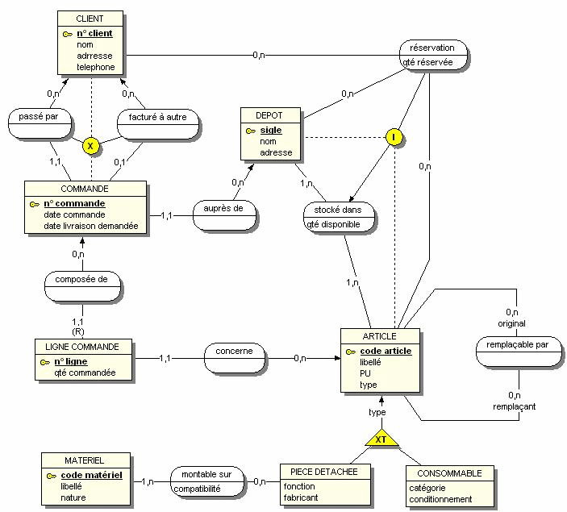

# Introduction aux bases de données <!-- omit in toc -->

## Sommaire <!-- omit in toc -->

- [Définition](#définition)
- [Cas d'usage](#cas-dusage)
- [Tables, propriétés et données](#tables-propriétés-et-données)
  - [Table](#table)
  - [Propriété](#propriété)
  - [Données](#données)
- [Modéliser une base de données : le MCD](#modéliser-une-base-de-données--le-mcd)
  - [Merise](#merise)
  - [Le MCD](#le-mcd)
    - [Les entités](#les-entités)
    - [Les relations](#les-relations)
    - [Les propriétés](#les-propriétés)
    - [Les cardinalités](#les-cardinalités)

## Définition

Selon le Larousse :

> ensemble structuré et organisé de données qui représente un système d'informations sélectionnées de telle sorte qu'elles puissent être consultées par des utilisateurs ou par des programmes

Selon Oracle :

> ensemble d'informations qui est organisé de manière à être facilement accessible, géré et mis à jour. Elle est utilisée par les organisations comme méthode de stockage, de gestion et de récupération de l’informations.

Exemples de base de données dans la vie de tous les jours :

- une bibliothèque
- le cerveau
- un musée
- un frigo
- un tableur (google sheet / microsoft excel)

## Cas d'usage

**Pour une application e-commerce** :

- sauvegarder les produits et leurs descriptions
- sauvegarder les stocks
- sauvegarder les commandes passées

**Pour une messagerie instantannée** :

- sauvegarder les messages passés
- sauvegarder les fichiers envoyés
- sauvegarder les salon de discussion

**Pour un CMS comme Wordpress** :

- sauvegarder les blocs visuels du site
- sauvegarder les images, les vidéos, les fichiers audio
- sauvegarder le contenu des articles de blog

## Tables, propriétés et données

Pour faciliter la compréhension, nous ferons des analogies avec des logiciel de tableur (google sheet / microsoft excel)

### Table

Une table permet de regrouper un ensemble d'informations sur un concept précis. Ces informations sont organisées en lignes et en colonnes. Chaque colonne correspond à une propriété précise et chaque ligne correspond à une nouvelle entrée dans cette table. Il est ainsi facile de stocker, retrouver et analyser ces informations.

**Exemple :**

Pour une application e-commerce :

- table user, pour regrouper les informations sur les utilisateurs
- table product, pour regrouper les informations sur les produits vendus par ue boutique

On peut rapprocher le concept de la table en base de données à celui de la feuille de calcul dans un tableur.

Dans une base de données dite relationnelle, il est possible qu'une table soit liée à une autre. Cela permet de pouvoir regrouper des informations communes à plusieurs concepts et d'éviter de répéter des informations dans plusieurs tables.

**Exemmples :**

Pour une bibliothèque :

- table user, pour regrouper les informations sur les membres de la bibliothèque
- table book, pour regrouper les informations sur les livres proposés par la bibliothèque
- table borrow, pour regrouper les informations sur les emprunts de livre par les membres, liée à la table user (pour savoir quel membre a emprunté) et à la table book (pour savoir quel livre a été emprunté)

### Propriété

Une propriété est un type d'information qui sera stockée dans une table. Une propriété sera configurée par :

- son nom, unique dans la table
- un type, pour savoir quel genre de donnée pourra être enregistrée (nombre entier, date, chaine de caractères, ...)
- d'autres options (UNIQUE, NOT NULL, PRIMARY KEY, ...)

On peut rapprocher le concept de la propriété en base de données à celui de la colonne dans un tableur.

**Exemples :**

Pour une table `user`, on pourra avoir les propriétés suivantes :

- firstname
- lastname
- dateOfBirth
- active

| firstname | lastname | dateOfBirth | active |
| --------- | -------- | ----------- | ------ |
|           |          |             |        |

Pour une table `book`, on pourra avoir les propriétés suivantes :

- title
- author
- edition
- isbn

| title | author | edition | isbn |
| ----- | ------ | ------- | ---- |
|       |        |         |      |

### Données

Une donnée est l'enregistrement d'une information dans une propriété d'une table.

On peut rapprocher le concept de la donnée en base de données à celui de la cellule dans un tableur.

**Exemples :**

Pour une table `user`, on pourra avoir les propriétés suivantes :

| firstname | lastname | dateOfBirth | active |
| --------- | -------- | ----------- | ------ |
| John      | Doe      | 1992/08/01  | 1      |
| Jane      | Smith    | 1985/05/15  | 1      |
| Alice     | Johnson  | 1978/11/23  | 0      |
| Bob       | Brown    | 2000/02/29  | 1      |

**Les types de propriété :**

| type      | description                             |
| --------- | --------------------------------------- |
| VARCHAR   | chaine de caractères                    |
| INT       | nombre entier                           |
| FLOAT     | nombre à virgule flottante              |
| BOOLEAN   | true ou false                           |
| DATETIME  | date et heure                           |
| TIMESTAMP | temps écoule en ms depuis le 01/01/1970 |

**Les options pour les propriétés :**

| options        | description                                                                   |
| -------------- | ----------------------------------------------------------------------------- |
| NOT NULL       | La propriété ne peut être vide                                                |
| UNIQUE         | La valeur ne peut pas être répétée dans la table                              |
| AUTO_INCREMENT | La valeur est un INT qui augmente de 1 à chaque nouvel enregistrement         |
| DEFAULT        | Spécifier quelle est la valeur par défaut si aucune n'est fournie             |
| PRIMARY KEY    | Cette propriété servira d'identifiant pour les enregistrements                |
| FOREIGN KEY    | Cette propriété servira d'identifiant pour les relations avec d'autres tables |

## Modéliser une base de données : le MCD

### Merise

Merise est une méthode utilisée pour modéliser des systèmes d'informations. Elle fournit des étapes à suivre pour faciliter  leur mise en place.

### Le MCD

Le MCD, ou Modèle Conceptuel des données, est la première étape de la méthode Merise et celle qui nous intéresse ici.

C'est une représentation graphique permettant de comprendre quels éléments composent un système, quelles sont les données qu'ils gèrent, et comment ces éléments intéragissent entre eux.

Pour produire un MCD, la personne en charge devra se fier à des spécifications techniques qu'on lui aura fournies, des interviews avec les clients/utilisateurs, des règles de gestion du métier, un ou des systèmes existants, ...

Un MCD se compose :

- d'entités (en rectangle)
- de relations (en oval et avec des traits reliant les entités)
- de propriétés dans les entités et parfois les relations
- de cardinalités (chiffres au dessus des traits entre les entités et relation)

#### Les entités

On désigne par entité dans un MCD un concept, un objet, un acteur, qui participe à notre système d'informations, qui manipule de la données et qui sera manipulé par le système. Une entité se caractérise par un nom et des propriétés.

#### Les relations

Les relations est le lien entre 2 ou plus entités. Ce sont elles qui caractérisent les systèmes dits relationnels (le R dans SGBDR). Une relation est définie par un verbe d'action permettant de comprendre comment les entités concernées sont liées entre elles, par des cardinalitées et parfois des propriétés.

#### Les propriétés

Les propriétés sont informations qui seront stockées puis manipulées par nos entités et leurs relations. Elles sont définies par un nom, unique au sein de l'entité ou de la relation, un type, et de leur options (FOREIGN KEY, NOT NULL, UNIQUE, ...).

#### Les cardinalités

Les cardinalités sont un outil permettant de comprendre les règles de gestion dans un système d'informations et d'apporter des contraintes sur les relations entre les entités. En effet, on peut savoir grâce à elles, combien d'exemplaires de l'eentité A peuvent être liés à l'entité B, et combien d'exemplaires de l'entité B peuvent être liés à l'entité A.

C'est pour cela que les cardinalités sont toujours en couples (une pour chaque côté de la relation) et avec 2 valeurs (un minimum et un maximum). En général, voici les valeurs que l'on donne aux cardinalités :

| valeurs | description                      |
| ------- | -------------------------------- |
| 0,1     | aucun ou 1 exemplaire au maximum |
| 0,N     | aucun ou plusieurs exemplaires   |
| 1,N     | au moins un exemplaire           |
| 1,1     | 1 exemplaire                     |

**Exemple :**

Dans cet MCD, on a une relation entre l'entité ARTICLE et l'entité LIGNE COMMANDE. Il faut lire : 

> une ligne commande est forcément rattachée à un article

> un article peut ne pas être lié à ligne commande, ou être lié à une infinité
